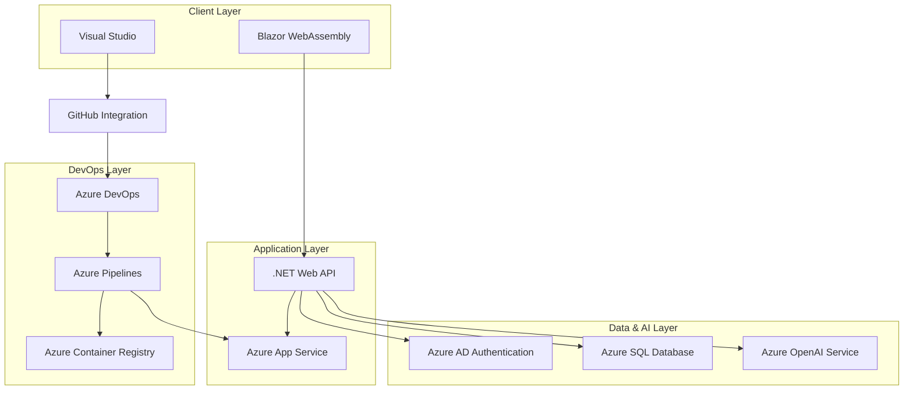

# AzureDevNexus - Intelligent Developer Ecosystem

<p align="center">
  
  
  
  
  
</p>

**Target Company:** Microsoft

## 📋 Table of Contents
* [Core Concept](#-core-concept)
* [System Architecture](#️-system-architecture)
* [Key Features](#-key-features)
* [Technology Stack](#-technology-stack)
* [Engineering Challenges](#-engineering-challenges--solutions)
* [Prerequisites](#-prerequisites)
* [Getting Started](#️-getting-started)
* [Microsoft-Aligned Features](#-microsoft-aligned-features)

## 🌟 Core Concept

An integrated, intelligent platform for software teams that fuses task management, documentation, and AI-powered developer tools, built on the end-to-end Microsoft ecosystem. The challenge lies in integrating multiple complex Azure services and building a sophisticated application entirely in C#/.NET - showcasing deep Microsoft technology expertise.

## 🏗️ System Architecture



This full-stack .NET application leverages the complete Microsoft ecosystem. Blazor WebAssembly provides a rich client experience while communicating with a .NET Web API backend. Azure services handle authentication, data storage, and AI capabilities, with Azure DevOps managing the entire development lifecycle.

## 🔧 Key Features

- [ ] Secure user authentication against Azure Active Directory (Azure AD)
- [ ] A Kanban-style project management board with drag-and-drop tasks
- [ ] A collaborative wiki for project documentation
- [ ] AI Code Reviewer: A feature to submit a C# snippet to the Azure OpenAI Service API for analysis
- [ ] The entire application is written in C#, with a Blazor frontend and .NET backend
- [ ] Storing structured data in an Azure SQL Database
- [ ] Automated build/test/deploy pipeline using Azure DevOps

## ⚡ Technology Stack

| Category | Technology | Rationale |
|----------|------------|-----------|
| **Frontend** | Blazor WebAssembly | C# in the browser, aligns with Microsoft's unified development model |
| **Backend** | C# + .NET 8 | Latest Microsoft framework with performance improvements and native AOT |
| **Database** | Azure SQL Database | Enterprise-grade relational database with built-in intelligence |
| **Authentication** | Azure Active Directory | Enterprise identity platform used across Microsoft ecosystem |
| **AI Services** | Azure OpenAI Service | Microsoft's ChatGPT integration for intelligent code analysis |
| **Cloud Platform** | Azure App Service | Platform-as-a-Service for seamless deployment and scaling |
| **Testing** | xUnit + Playwright | Modern .NET testing with browser automation for Blazor |
| **Infrastructure as Code** | Azure Bicep | Declarative infrastructure deployment and management |
| **DevOps** | Azure DevOps Pipelines | Complete CI/CD solution integrated with Microsoft ecosystem |

## 🧠 Engineering Challenges & Solutions

### **Challenge 1: Blazor WebAssembly Performance Optimization**
* **Problem:** Large .NET runtime download affecting initial page load times and mobile performance.
* **Solution:** Implement lazy loading of assemblies, AOT compilation for reduced bundle size, and progressive web app caching strategies. Use Blazor Server hybrid mode for critical performance scenarios.

### **Challenge 2: Azure Service Integration Complexity**
* **Problem:** Managing authentication flows, API rate limits, and service dependencies across multiple Azure services.
* **Solution:** Implement Azure Managed Identity for secure service-to-service communication, circuit breaker patterns for API resilience, and comprehensive logging with Application Insights for debugging.

### **Challenge 3: Real-time Collaboration Features**
* **Problem:** Enabling real-time updates for multiple users editing project boards and wiki pages simultaneously.
* **Solution:** Use SignalR for WebSocket communication, implement operational transformation for conflict resolution, and leverage Azure SQL's change tracking for efficient data synchronization.

## 📋 Prerequisites

- .NET 8 SDK
- Visual Studio 2022 or VS Code with C# extension
- Azure subscription with appropriate permissions
- Azure CLI installed and configured
- Docker Desktop (for local development)

## 🛠️ Getting Started

1. **Clone and Setup**
   ```bash
   git clone <repository-url>
   cd AzureDevNexus
   ```

2. **Azure Resources Setup**
   ```bash
   # Deploy Azure resources using Bicep templates
   az deployment group create --resource-group myRG --template-file infrastructure/main.bicep
   ```

3. **Application Configuration**
   ```bash
   # Configure app settings
   cp appsettings.example.json appsettings.json
   # Update Azure service connection strings
   ```

4. **Local Development**
   ```bash
   # Restore dependencies
   dotnet restore
   
   # Run the application
   dotnet run --project src/AzureDevNexus.Server
   ```

5. **Azure DevOps Pipeline Setup**
   ```bash
   # Import the pipeline definition
   az pipelines create --name AzureDevNexus --repository <repo-url> --branch main
   ```

## 🧪 Running Tests

- **Unit Tests:** `dotnet test`
- **Integration Tests:** `dotnet test --filter Category=Integration`
- **UI Tests:** `dotnet test --filter Category=UI`

## 🎯 Microsoft-Aligned Features

This project showcases skills directly relevant to Microsoft's engineering culture:

| Microsoft Focus Area | AzureDevNexus Implementation | Why It Matters |
|----------------------|------------------------------|----------------|
| **Full .NET Ecosystem** | Blazor + .NET backend + Azure integration | Core to Microsoft's unified development platform |
| **Azure Cloud Integration** | Native Azure services usage | Essential for Microsoft's cloud-first strategy |
| **AI-powered Development** | Azure OpenAI code analysis | Central to Microsoft's Copilot vision |
| **Enterprise Authentication** | Azure AD integration | Fundamental to Microsoft's identity solutions |
| **DevOps Excellence** | Azure DevOps end-to-end pipeline | Critical for Microsoft's development lifecycle |
| **Developer Productivity** | Integrated development tools | Key to Microsoft's developer-first mission |

### **Why AzureDevNexus Appeals to Microsoft:**
- Demonstrates **deep .NET expertise** across the entire stack
- Shows **Azure cloud mastery** using Microsoft's own platform
- Exhibits **AI integration skills** essential for Microsoft's Copilot strategy
- Proves **enterprise development** capabilities with Azure AD and SQL
- Showcases **modern C# development** with latest .NET features

## 🎯 Why "AzureDevNexus"?

The name reflects the convergence ("nexus") of Azure cloud services with development workflows, embodying Microsoft's vision of unified, intelligent developer experiences.

---

*Built with 💙 for empowering every developer on the planet*
